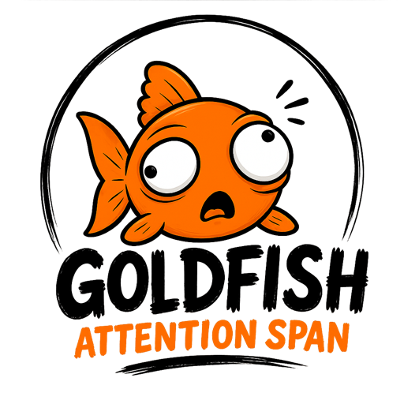

<p align="center">
  
</p>

<p align="center"><em>Make the agent know you have the attention span of a goldfish, and talk accordingly.</em></p>

<p align="center">
  
  
  
</p>

---

Nine paragraphs. You read two. What you needed was in paragraph seven.

Goldfish is the last pass over every reply: **a word budget, then one frame.** Under it, the single thing that decides your next move.

## Before / after

**Without** · 86 words

> I've gone ahead and updated the authentication middleware. The issue was that the token expiry check was using a strict less-than comparison, which meant tokens expiring exactly at the boundary were being rejected one second early. I changed it to less-than-or-equal. I also noticed the refresh logic could be cleaner, so let me know if you'd like me to look at that as well. The tests should pass now, but you may want to run them to confirm. Let me know if you need anything else!

**With goldfish** · 21 words

> Fixed `auth/middleware.ts:42` — expiry check used `<`, now `<=`. Refresh logic untouched.
>
> ┈┈┄┄──────╼━━━━ ༼ ◕_◕ ༽ ━━━━╾──────┄┄┈┈
>
> **Run `npm run test:auth` to confirm.**

## Install

```bash
claude plugin marketplace add kaminskypavel/goldfish-attention-skill
claude plugin install goldfish-attention-span@goldfish-attention-span
```

```bash
codex plugin marketplace add kaminskypavel/goldfish-attention-skill
codex plugin add goldfish-attention-span@goldfish-attention-span
```

Or, for the 30-odd other agents — Cursor, Cline, Gemini CLI, Antigravity, Continue and the rest:

```bash
npx skills add kaminskypavel/goldfish-attention-skill
```

Active next session. No config, no dependencies, no Node. Any other agent: drop [`SKILL.md`](skills/goldfish-attention-span/SKILL.md) into its rules file — one file, no moving parts.

## Levels

| Command | Cap | Reach for it when |
|---|--:|---|
| `/goldfish lite` | 200 words | A review or a trade-off — something with reasoning to carry |
| `/goldfish full` | 100 words | Default. Normal back-and-forth |
| `/goldfish ultra` | 50 words | You are skimming. Verdict and next move, nothing else |
| `/goldfish 250` | any integer | You want a specific budget |
| `/goldfish off` | — | Inert until you say `goldfish` again |

In Codex the prefix is `@`, not `/` — `@goldfish ultra`.

Only the number moves — every other rule is identical at every level, and the frame never scales. The level persists in `~/.claude/.goldfish-level`, so it survives `/clear` and the next session.

## Rules

**Cap** — free text only. Code, paths, commands, tables and error strings are never touched.

**Frame** — exactly one, last thing in the reply, max 15 words one blank line under the separator. The face rotates each reply and never repeats back to back:

```
┈┈┄┄──────╼━━━━ (⊙_⊙) ━━━━╾──────┄┄┈┈
┈┈┄┄──────╼━━━━ (ಠ_ಠ) ━━━━╾──────┄┄┈┈
┈┈┄┄──────╼━━━━ (◕‿◕) ━━━━╾──────┄┄┈┈
┈┈┄┄──────╼━━━━ (＾▽＾) ━━━━╾──────┄┄┈┈
┈┈┄┄──────╼━━━━ ◕_◕ ━━━━╾──────┄┄┈┈
┈┈┄┄──────╼━━━━ ◔_◔ ━━━━╾──────┄┄┈┈
┈┈┄┄──────╼━━━━ ༼ ◕_◕ ༽ ━━━━╾──────┄┄┈┈
```

The rule is heaviest at the face and dissolves outward — dotted, dashed, light, heavy — so the eye lands on the face and the ends fade off. Never fenced in real output, so `code spans` and colour still render beneath it. Fifteen cells a side, no compensating for face width: narrow enough to survive a split pane or a phone.

Picked by what changes your next move: a pending question beats a status, a blocker beats a win. Two frames is zero frames.

The cap lifts when you ask for an explanation or a report, and for security and destructive-action warnings. The frame never lifts.

Chat only. Files, commits, PRs and tool arguments are untouched.

Stacks under any other voice or structure mode — that one drafts, goldfish caps and frames. Voice is inherited, never undone. Nothing to configure.

## Off

`/goldfish off`, `stop goldfish`, or `normal mode`.

---

`sh tests/activate.test.sh` · MIT
